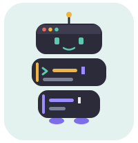

<div align="center">
  

# promptu-app

*A macOS menubar companion to [promptu](https://github.com/mrcnski/promptu):
compose LLM prompts from building blocks, from any app, no Emacs required.*
</div>

Press `⌥⌘P` from any app (or click the menubar icon), press block keys to
build the prompt while watching the live preview, then press `RET` — the
composed prompt lands on the clipboard and focus returns to where you were,
ready to paste.

The hotkey is a constant in `AppDelegate.swift` (`hotKeyCode` /
`hotKeyModifiers`); it overrides the same combination in whatever app is
focused, so pick one nothing else needs.

The panel follows the system appearance: [Catppuccin
Latte](https://catppuccin.com) in light mode,
[Nimbus](https://github.com/mrcnski/nimbus-theme) in dark mode
(palettes in `Theme.swift`).

## Blocks

Blocks are read from `~/.config/promptu/blocks.json`, the same file Emacs
promptu can load via `promptu-blocks-from-json`. Edit once, both frontends
update. On first launch, when the file doesn't exist, it is seeded with
promptu's default block set — edit from there. An existing file is never
touched. The file is an array of objects mirroring promptu's block plists:

```json
[
  { "key": "r", "desc": "review", "text": "review your changes" },
  { "key": "i", "desc": "investigate", "text": "investigate {link}", "placeholders": ["link"] },
  { "key": "P", "desc": "push", "text": "push when done", "negative": "don't push" }
]
```

`{name}` placeholders are prompted for when the block is added. Blocks are
re-read on app restart.

## Keys

| Key            | Action                                             |
|----------------|----------------------------------------------------|
| _block_        | Add that block at the point                        |
| `-`            | The next block added is negated                    |
| `⌫`            | Remove the entry above the point (or the last one) |
| `↑`/`↓` (or `C-p`/`C-n`) | Move the point, shown as `▮` in the preview |
| `⌘E`           | Edit the entry above the point (or the last one)   |
| `⌘Z` / `⇧⌘Z`   | Undo / redo                                        |
| `RET`          | Copy the composed prompt, close the panel          |
| `ESC`          | Close the panel (prompt is kept)                   |
| `⌥⌘P`          | Summon the panel from anywhere (global)            |
| `⌘Q`           | Quit                                               |

## Build

```sh
make test      # run the core tests
make run       # run from the checkout
make app       # build dist/Promptu.app (ad-hoc signed)
make install   # copy it to /Applications
```

Requires macOS 14+ and a Swift 6 toolchain (Xcode 16+).

After quitting, relaunch with `open dist/Promptu.app` from the checkout, or —
once `make install` has run — launch "Promptu" from Spotlight or
/Applications. To start at login: System Settings → General → Login Items,
add Promptu.

## Not (yet) ported from Emacs promptu

- History (`M-p` / `M-n` / `M-r`)
- Whole-prompt free-text editing (`M-E`)
- Custom `promptu-separator` / negation prefix (fixed at `"\n- "` / `"don't "`)

## TODO

- [ ] Use the mascot as the app icon.

## License

GPL-3.0, like promptu.
