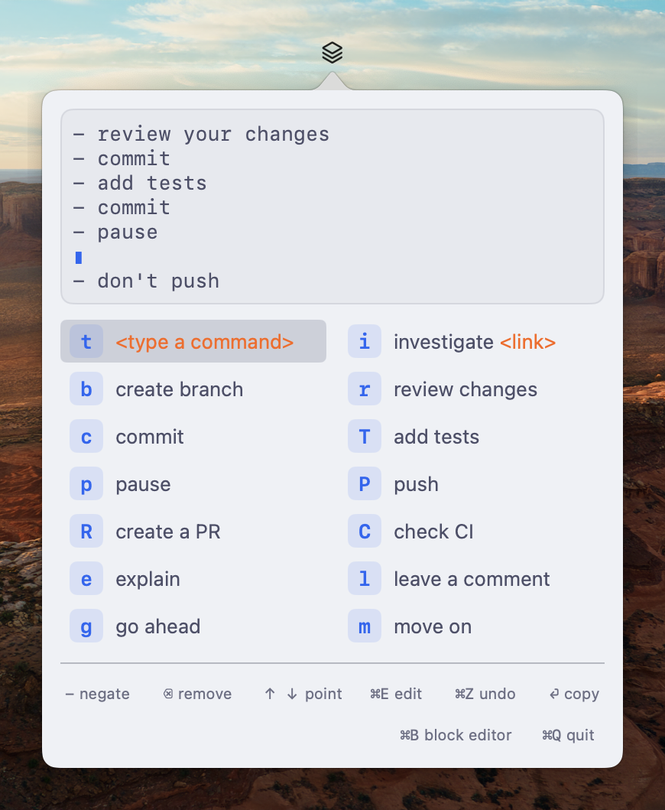

<div align="center">
  

# promptu-app

Compose LLM prompts from building blocks, right from the menubar!

*The opposite of 'impromptu': composed, not off-the-cuff.*


</div>

## Usage

Press `⌥⌘P` (the default hotkey) from any app, or click the menubar icon,
to open promptu.

Press block keys to build the prompt while watching the live preview, then press
`RET`.  The composed prompt lands on the clipboard and focus returns to where
you were, ready to paste.

The panel follows the system appearance by default: [Catppuccin
Latte](https://catppuccin.com) in light mode,
[Nimbus](https://github.com/mrcnski/nimbus-theme) in dark mode.

`⌘,` opens the settings screen, where the theme can be pinned and the
global hotkey re-recorded; both choices are remembered.

## Blocks

Blocks are read from `~/.config/promptu/blocks.json`, the same file Emacs
promptu can load via `promptu-blocks-from-json`. Edit once, both frontends
update. On first launch, when the file doesn't exist, it is seeded with
promptu's default block set — edit from there. An existing file is never
touched. The file is an array of objects mirroring promptu's block plists:

```json
[
  { "key": "r", "desc": "review", "text": "review your changes" },
  { "key": "i", "desc": "investigate", "text": "investigate {link}", "placeholders": ["link"] },
  { "key": "P", "desc": "push", "text": "push when done", "negative": "don't push" }
]
```

`{name}` placeholders are prompted for when the block is added. Blocks are
re-read on app restart.

Blocks can also be edited in-app: `⌘B` opens the Block Editor — click a
block to change or delete it, or add a new one. Saving rewrites
blocks.json (the `placeholders` field is derived from `{name}`s in the
texts), so Emacs promptu picks the changes up too.

## Keys

| Key            | Action                                             |
|----------------|----------------------------------------------------|
| _block_        | Add that block at the point                        |
| `-`            | The next block added is negated                    |
| `⌫`            | Remove the entry above the point (or the last one) |
| `↑`/`↓` (or `C-p`/`C-n`) | Move the point, shown as `▮` in the preview |
| `⌘E`           | Edit the entry above the point (or the last one)   |
| `⌘Z` / `⇧⌘Z`   | Undo / redo                                        |
| `RET`          | Copy the composed prompt, close the panel          |
| `⌘B`           | Toggle the Block Editor                            |
| `⌘,`           | Toggle settings (theme, hotkey)                    |
| `ESC`          | Close the panel (prompt is kept)                   |
| `⌥⌘P`          | Summon the panel from anywhere (global, default)   |
| `⌘Q`           | Quit                                               |

## Install

Download `Promptu-<version>.zip` from
[Releases](https://github.com/mrcnski/promptu-app/releases), unzip, and
drag Promptu.app into /Applications. The app is ad-hoc signed and not
notarized, so macOS quarantines the download; clear the flag once:

```sh
xattr -d com.apple.quarantine /Applications/Promptu.app
```

Or build from source (below) — locally built apps need no blessing.

## Build

```sh
make test      # run the core tests
make run       # run from the checkout
make app       # build dist/Promptu.app (ad-hoc signed)
make install   # copy it to /Applications
```

Requires macOS 14+ and a Swift 6 toolchain (Xcode 16+).

After quitting, relaunch with `open dist/Promptu.app` from the checkout, or —
once `make install` has run — launch "Promptu" from Spotlight or
/Applications. To start at login: System Settings → General → Login Items,
add Promptu.

## Todo

- History
- Whole-prompt free-text editing
- Custom separator / negation prefix (fixed at `"\n- "` / `"don't "`)
- Homebrew cask, once there are releases to point at (`brew install --cask`
  from a personal tap; brew can also skip the quarantine flag)
- Universal (Intel + Apple Silicon) release binaries — needs full Xcode
  for `swift build --arch arm64 --arch x86_64`; releases are currently
  Apple Silicon only

## See also

- The original [Emacs package](https://github.com/mrcnski/promptu) that started
  it all!

## License

GPL-3.0, like promptu.
